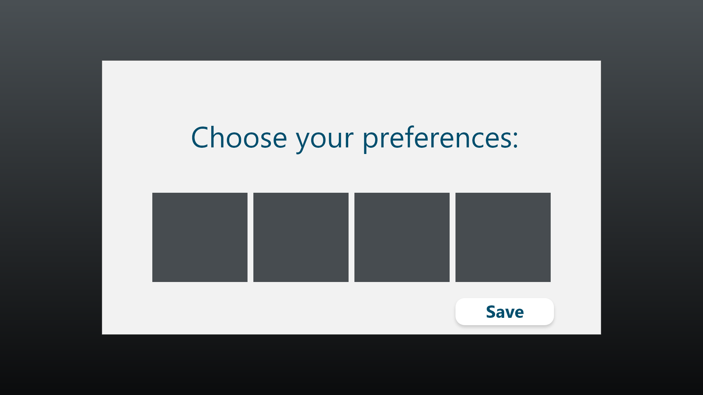
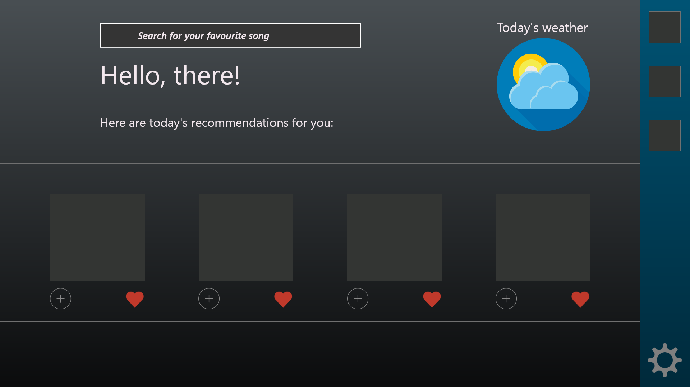

# Aplicație pentru managementul melodiilor favorite integrată cu Spotify

----
## Introducere

* **Care este principala nevoie/problemă pe care o rezolvă produsul vostru?**

   Fie că ești vesel sau trist, că vrei să te distrezi sau să înveți mai bine, muzica este resursa la care poți apela oricând. Echipa noastră este de părere că muzica reprezintă o parte importantă din viața fiecăruia, așa că ne-am gândit să creăm o aplicație prin care utilizatorii să aibă ușor acces la muzica pe care o iubesc, dar și să descopere muzică nouă, potrivită cu gusturile lor. Așadar, proiectul nostru are, pe lângă funcția de a crea rapid playlist-uri cu melodiile preferate, și scopul de a facilita procesul de căutare al unui cântec în funcție de vreme sau de starea de spirit a utilizatorului. Folosind Spotify API și Weather API, ne dorim astfel să creăm un manager de melodii favorite care să îi poată face utilizatorului recomandări influențate de preferințele actuale și de starea de spirit pe care vremea de afară i-o poate induce. Încercăm astfel să oferim o experiență personalizată pentru fiecare utilizator – aplicația înțelegând și adaptandu-se la starea și gusturile clientului. Totodată, noi considerăm util că utilizatorul să poată afla, dacă își dorește, detalii legate de muzica aleasă, astfel încât îi punem la dispoziție diverse statistici legate de caracteristicile audio ale pieselor, de autorii acestora și nu numai. 
  
 *  **Cărui tip de utilizatori se adresează produsul vostru?** 
  
    În același timp, deoarece considerăm că pasiunea pentru muzică nu are vârstă, credem că tipul de utilizatori de care îl avem în vedere nu se poate înscrie într-un tipar, pentru că ne dorim ca proiectul nostru să poată fi folositor oricui, indiferent de gusturi, hobby-uri sau stare de spirit. 
  
 * **Ce alte produse similare există în piată?** 
  
    Aplicația noastră va funcționa într-un domeniu în care există deja destul de mulți competitori foarte cunoscuți, cum ar fi **Apple Music, Google Play Music, Spotify, Deezer, Tidal, Zonga, SoundCloud** și mulți alții. Totuși, din cercetarea de piață pe care am făcut-o până acum, nu am găsit un produs care să prezinte aceeași funcționalitate de recomandare de melodii în funcție de starea utilizatorului pe care o propunem noi, așa că noi suntem încrezători în faptul că vom aduce un plus de valoare industriei și că ne vom face remarcați prin serviciul nostru intuitiv la dorințele clientului, ușor de folosit și gratis. 

----
## Interfețele aplicației

----
## Componentele aplicației
1. Listă de features ale melodiilor
2. Widget meteo
3. Listă de melodii recomandate
4. Previzualizare detalii și caracteristici melodie
5. Playlist
6. Căutare melodii

----

## REST API

**Request**

    POST /preferences?preferences={preferencesParam}

Utilizatorul își adaugă preferințele inițiale, pentru a putea primi recomandări.

**Request** 

    PUT /preferences?preferences={newPreferences}

Utilizatorul își schimbă preferințele.

**Request**

    GET /songs?search={weatherParam} 
În funcție de prognoza meteo, platforma întoarce o listă cu melodii specifice, conform preferințelor alese de utilizator.

**Response generic** 

    [
        {
        „name”:”Song’s name”;
        „category”:”Song’s category”;
        „artist:”:”Song’s artist”;
        }
    ]

**Request**

    GET /songs?search={songName}
Platforma oferă posibilitatea căutarii unei melodii în funcție de numele său.

**Request**

    GET /features?song={songParam}

Întoarce o listă cu caracteristicile melodiei.

**Response**

    [
        {
            "danceability" : 0.735,
            "energy" : 0.578,
            "valence" : 0.624,
            "duration_ms" : 255349,
            "artist": "song's artist",
            "album": "song's album",
            "likes": 0
        }
    ] 

**Request**

    POST /playlist?playlistName={playlistNameParameter}&songName={songNameParameter}
Utilizatorul are posibilitatea să adauge melodiile preferate intr-un playlist.

**Request**

    GET /playlist?search={playlistName}&orderBy={songName}
Sunt afișate melodiile ordonate alfabetic din playlist-ul dorit.

**Request**

    DELETE /playlist?playlistName={playlistNameParameter}&songName={songNameParameter}

Utilizatorul poate șterge o anumită melodie din playlist dată ca parametru sau poate șterge întreg playlist-ul daca nu este specificat al doilea parametru.

---
## Acțiunile utilizatorilor
 
1. Alegerea preferințelor în materie de muzică, în 
   funcție de tipul de vreme
1. Posibilitatea de a schimba preferințele
1. Vizualizarea melodiilor recomandate în funcție de preferințele de vreme
1. Căutarea unei melodii după numele acesteia
1. Vizualizarea unor detalii și statistici referitoare la o melodie selectată sau căutată
1. Adăugarea unei melodii din cele recomandate de aplicație la playlist / favorites
1. Vizualizarea melodiilor din playlist-ul creat
1. Ștergerea unei melodii din playlist sau a întregului playlist

